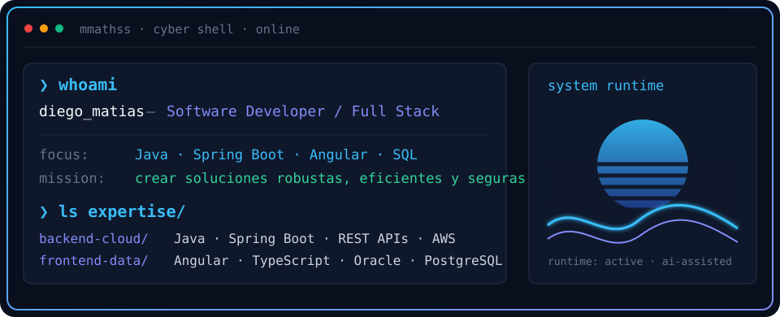

<!-- LOCAL BANNER -->
<a href="https://github.com/mmathss">
  <picture>
    <source media="(prefers-color-scheme: dark)" srcset="assets/banner-dark.v9.svg">
    <source media="(prefers-color-scheme: light)" srcset="assets/banner-light.v9.svg">
    
  </picture>
</a>

 

 

---

## `$ whoami`

  

 

## `$ cat tech-stack.yaml`

<table border="1" cellpadding="14" bgcolor="#0d1527">
  <thead>
    <tr>
      <th colspan="2" align="left"><code>mmathss:~$ cat tech-stack.yaml</code></th>
    </tr>
  </thead>
  <tbody>
    <tr>
      <td width="50%" valign="top"><code>├─ ☁ cloud_infrastructure / backend:</code>  
         
        <code>AWS · Java · Spring Boot · REST APIs · PL/SQL</code>
      </td>
      <td width="50%" valign="top"><code>├─ ▣ databases_messaging:</code>  
        
        
         
        <code>Oracle · PostgreSQL · MySQL · Microsoft SQL Server</code>
      </td>
    </tr>
    <tr>
      <td valign="top"><code>├─ ⚙ containers_ci_cd / devops / tools:</code>  
         
        <code>Docker · Git · GitHub · Linux · AWS (ECS, CloudFront, S3)</code>
      </td>
      <td valign="top"><code>├─ ◉ monitoring_testing / frameworks:</code>  
         
        <code>Angular · React · QA/Testing · Postman</code>
      </td>
    </tr>
    <tr>
      <td valign="top"><code>├─ ✦ languages_core:</code>  
         
        <code>Java · C# · C++ · PHP · Node.js · TypeScript · JavaScript · SQL</code>
      </td>
      <td valign="top"><code>╰─ ⌁ security_libraries:</code>  
        
         
        <code>OAuth 2.0 · JWT · Spring Security · Bootstrap · REST Architecture</code>
      </td>
    </tr>
  </tbody>
  <tfoot>
    <tr>
      <td colspan="2"><code>status: active&nbsp;&nbsp;·&nbsp;&nbsp;focus: backend_oriented_fullstack</code></td>
    </tr>
  </tfoot>
</table>

 

<!-- SPECIALIZATION CALLOUT -->
<table border="1" cellpadding="14" bgcolor="#0d1527">
  <thead>
    <tr>
      <th align="left"><code>mmathss:~$ cat ai-specializations.yaml</code></th>
    </tr>
  </thead>
  <tbody>
    <tr>
      <td align="left">
        <code>✦ ai_agents_and_assisted_engineering:</code>  
        &nbsp;
        &nbsp;
        &nbsp;
        
          
        <code>Desarrollo asistido con Agentes Autónomos (Claude, Google Antigravity, OpenAI Codex) · Protocolo MCP · Prompt Engineering · Workflows de automatización y refactorización</code>
      </td>
    </tr>
  </tbody>
</table>

---

## `$ kubectl get signals --all-namespaces`

  <picture>
    <source media="(prefers-color-scheme: dark)" srcset="assets/radar-dark.svg">
    <source media="(prefers-color-scheme: light)" srcset="assets/radar-light.svg">
    
  </picture>&nbsp;
  <picture>
    <source media="(prefers-color-scheme: dark)" srcset="assets/radar-langs-dark.svg">
    <source media="(prefers-color-scheme: light)" srcset="assets/radar-langs-light.svg">
    
  </picture>

<code>signals: dev_skill_radar · language_stack_radar · status: healthy</code>

---

<!-- SOCIALS -->
## `$ connect --socials`

&nbsp;&nbsp;
&nbsp;&nbsp;

 
 

<code>Diego Matías (@mmathss) · Software Developer</code>

